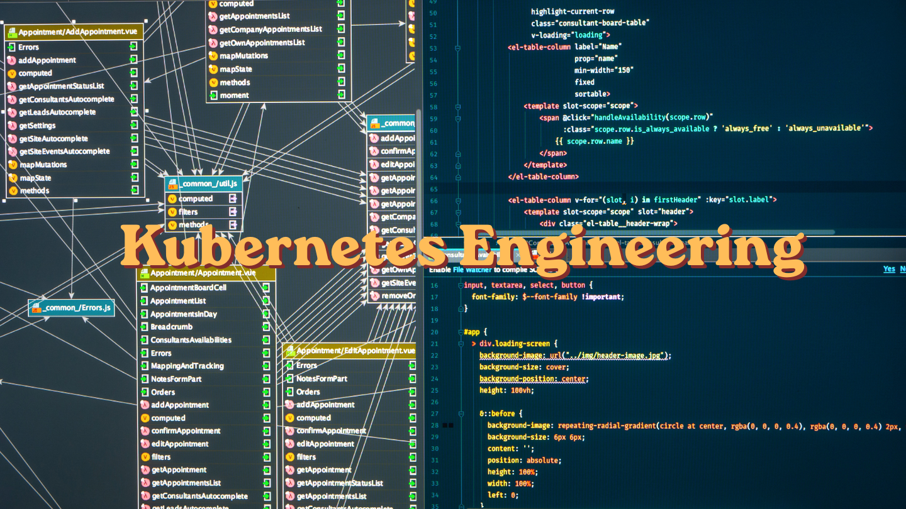

# Project # 36: Kubernetes Engineering Case Studies

## Context

All 28 case studies come from a single long-term engagement with a US-based enterprise SaaS platform running 400+ API microservices across multi-region Kubernetes clusters. My role was Senior Kubernetes Engineer, responsible for cluster operations, service mesh management, observability, GitOps pipelines, and infrastructure migrations.

**Core stack:** Kubernetes, Istio, ArgoCD, FluxCD, Helm, Prometheus, Grafana, Loki, Tempo, Mimir, Jaeger, Kiali, Elasticsearch, Kibana, Auth0

---

## What's Inside

### Deployment & GitOps
- Managing 100+ microservice deployments across Dev, Staging, Testing, and Production using ArgoCD and Helm
- Debugging and resolving ArgoCD sync failures including undefined variables and missing chart components
- Running FluxCD alongside ArgoCD with a clean ownership boundary between application and infrastructure workloads
- Namespace-based cluster organization and governance strategy

### Istio Service Mesh
- Canary deployments using DestinationRule subsets and VirtualService weighted traffic splitting (80/20)
- Circuit breaking with outlier detection — automatic pod ejection from load balancing pool on timeout
- mTLS enforcement across namespaces with controlled rollback strategy
- Resolving mTLS connectivity failures between mesh and non-mesh workloads using ServiceEntry and DestinationRule
- VirtualService and Gateway configuration for domain-based API traffic routing
- Enabling Istio sidecar injection for PostgreSQL with zero-downtime staged rollout

### Observability
- Full LGTM stack deployment: Loki, Grafana, Tempo, Mimir
- Prometheus and Grafana setup via ArgoCD with accurate ServiceMonitor configuration for every microservice
- Distributed tracing across 100+ services using Jaeger integrated with Istio and Kiali
- Elastic Agents deployed as DaemonSet for cluster-wide log and metrics collection
- Real-time service mesh observability and Istio config validation using Kiali
- Fixing Prometheus alert rules that were silently non-functional due to namespace mismatch

### Security
- Encryption at rest for Kubernetes Secrets at the etcd level
- Auth0 SSO integration for Grafana and Prometheus
- Role-based access control inside Grafana via Auth0 custom Actions and ID token claims

### Infrastructure & Migration
- Full multi-region infrastructure migration with zero data loss
- Bash script for automated multi-region Helm manifest generation across 100+ services
- Bitnami Helm chart migration from legacy repository to OCI registry
- Migrating Elasticsearch and Kibana deployment into GitOps workflow via internal ECK stack chart

### Debugging & Problem Solving
- Diagnosing and fixing inter-service DNS resolution failures across namespaces
- Identifying a Python date type mismatch causing repeated API endpoint failures
- Resolving instanceLabel configuration errors across multiple Helm chart repositories

---

## Format

Each case study follows a consistent structure:

**Situation** — the environment and context  
**Problem** — what was broken, missing, or at risk  
**What I Did** — the technical approach and reasoning  
**Outcome** — what changed as a result

Client infrastructure details have been kept generic. Open-source tooling is named throughout as it is not client-identifying.

---

## File

The full case studies document is available in this repository as a Word file for easy reading and reference.
